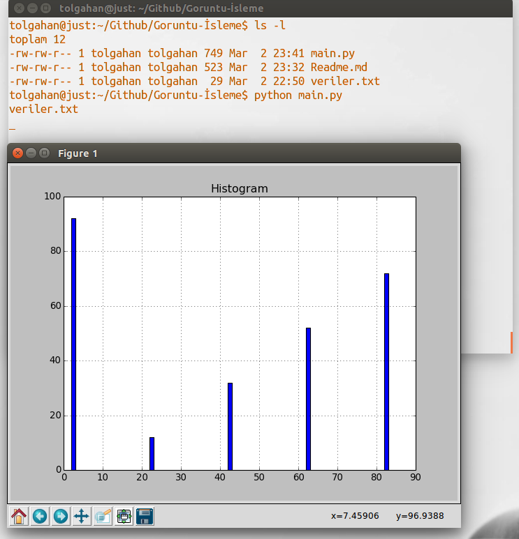

# Histogram Grafiği Çıkartma

- Görüntü işleme dersinde verilerin histografik haritasını çıkartmaya yarayan python kodudur.

### Kurulum Aşaması

Python dosyasını aşağıdaki adımlarla çalıştırabilirsiniz.

```sh
$ sudo apt-get install python-matplotlib

$ git clone 'url'

$ python main.py 

$ veriler.txt (Dizin içinde bulunan txt belge yolu)

```

### Veri Dosya formatı

Veri dosyasında x ve y eksenleri aşağıdaki iterastonda olması gerekmektedir.

```sh
X0 Y0
X1 Y1
X2 Y2

```

### Örnek



-Verison 0.0.1